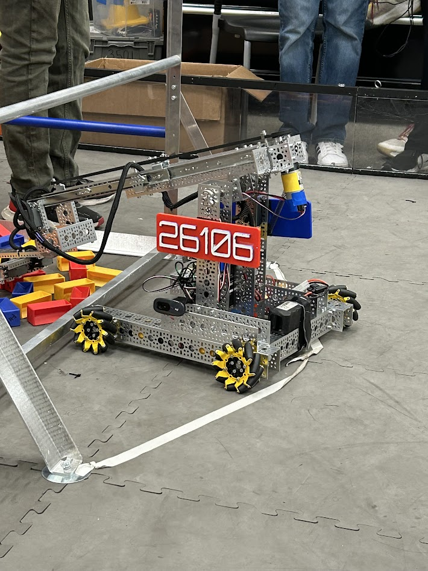
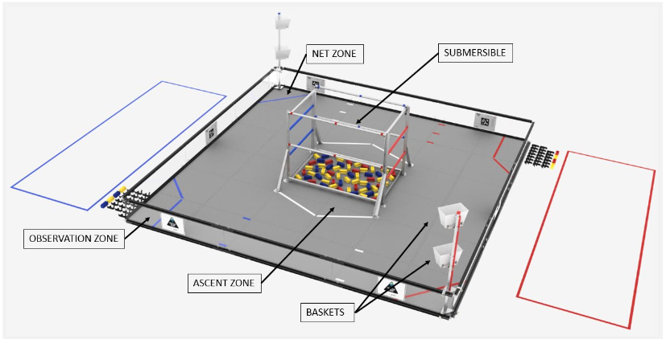
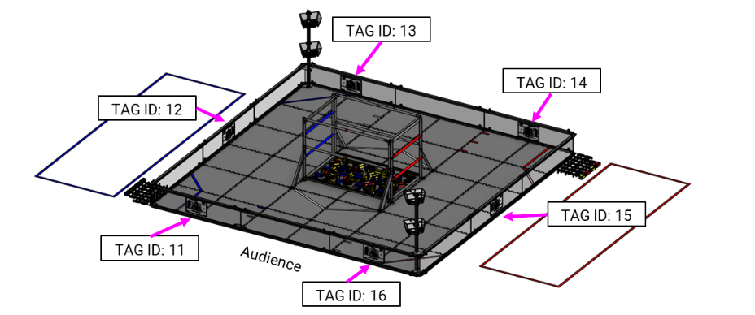

# comms-7b - Fremont High School Robotics (2024-25)
Webpage for Communications MB Requirement 7b.    
This webpage is written in Markdown and hosted on Github Pages.   
#### I am a member of the FHS Robotics Team, more specifically the FIRST Tech Challenge 'Emberbots (26106)' team. This is a demo site with a few articles regarding key contributions I made this season.
     

     
## Auton Design (January '25)
After our first competition, we prioritized implementing autonomous driving for use in the first 30 seconds of every match. Our original auton only drove and parked in the 'observation zone', scoring 3 points. Our next goal was to score a piece in the 'high basket' scoring 10 points.  
   
It was important for us to develop multiple versions of the auton, depending on where we would start on this field. This was a priority because we wanted to play to both our and our allied team's strengths, allowing us to score as much as possible. Therefore, we made 3 different OpModes (pieces of code that can be run) to start at 3 different positions. We perfected each of these OpModes for speed and stability, ensuring consistent scoring.   
Another consideration was the reset at the end of the Auton period, ahead of the driver operated period. Since our robot decided it's movement limits (for example, in the arm) based on its starting position, this position had to be the same whenever the robot restarted. We made sure that the robot had adequate time to complete this reset, so our drivers would have access to the full range of motion. Finally, I implemented an 'Auton Abort' feature, which would automatically cancel the current movement and reset the robot if time was running low.
   
## AprilTag Integration (January '25)
Scoring in auton was crucial for us, as all methods of scoring are valued higher in this period of the game. Due to the low time after scoring in the high basket, we decided to drag preset pieces on the floor into the 'net zone', which also scores some points. In order to do this reliably, we needed the robot to be sure of its position. To do this, we utilized AprilTags, which are QR code like tags around the field.     

Using a camera, we can interpolate data such as the robot's angle to and distance from the tag. After lining, up, the robot could then reliably collect the preset pieces to complete scoring.

## 
